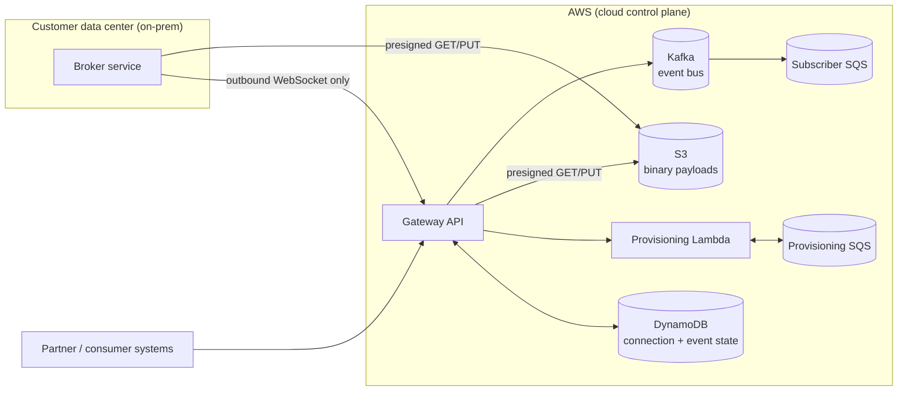

# Architecture Case Study: Scaling a Hybrid Cloud / On-Prem Content Platform

## Context

This is a series of Architecture Decision Records (ADRs) drawn from real work I led as part
of a small platform team (4-6 engineers) building the AWS-hosted control plane for a
federated content-integration platform. The platform connects cloud-based consumers to
enterprise content systems (ECMs) that live on-premises in customer data centers — think
document management, case management, and records systems that customers will never expose
to the public internet.

The throughline across all six decisions is the same constraint: **customers will not open
inbound firewall ports, and the platform has to be reliable and scale at enterprise volume
anyway.** That constraint shaped almost every architectural call described here — from how
the cloud and on-prem sides talk to each other, to how binary content moves, to how
provisioning and eventing are built to survive partial failure without an ops team babysitting
queues.

I was the lead among a small team on the AWS-facing side of this work (API Gateway, Lambda,
DynamoDB, SQS/SNS, S3, Terraform), with the decisions below reflecting either calls I made
directly or ones I drove consensus on with the team and stakeholders.

## Why this exists

These are the kind of decisions that don't show up in a resume bullet or a system-design
whiteboard exercise — they show up when you've actually had to live with the tradeoff for a
year, watch it break in production once, and decide whether to keep it or change it. That's
what I want to demonstrate here: not "I know what API Gateway is," but "here's how I reasoned
about a real constraint, what I gave up to get it, and what I'd do differently."

## Index

| ADR | Decision | Status |
|---|---|---|
| [ADR-001](adr/001-outbound-only-tunnel.md) | Outbound-only WebSocket tunnel from on-prem to cloud | Accepted, in production |
| [ADR-002](adr/002-s3-presigned-binary-transfer.md) | S3 presigned URLs for binary content, not over the tunnel | Accepted, in production |
| [ADR-003](adr/003-lambda-sqs-provisioning.md) | Lambda + SQS for async subscription provisioning | Accepted, in production |
| [ADR-004](adr/004-dynamodb-connection-state.md) | DynamoDB for WebSocket connection and event-reply state | Accepted, in production |
| [ADR-005](adr/005-events-platform-pubsub.md) | Kafka + SQS + DynamoDB for the partner-facing events platform | Accepted, in production |
| [ADR-006](adr/006-terraform-over-crossplane.md) | Terraform over Crossplane for infrastructure-as-code | Accepted, migration complete |

## Diagram: platform topology

Each ADR below goes into the specific decision, the options considered, and the tradeoff.
